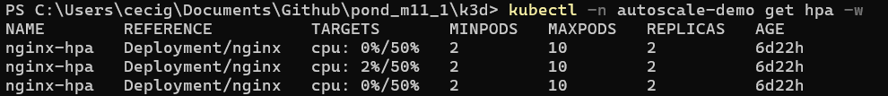

# Atividade Ponderada - Kubernetes Autoscaling com K3d e HPA
Esta atividade prática teve como objetivo aplicar os conceitos de Kubernetes e escalabilidade, criando um cluster local com K3d e configurando o Horizontal Pod Autoscaler (HPA) sobre uma aplicação NGINX.

## Objetivo
Compreender como o Kubernetes consegue ajustar dinamicamente o número de réplicas de uma aplicação com base no consumo de CPU.

Para isso, foram realizadas as seguintes etapas:
- Criar um cluster Kubernetes local utilizando **K3d** 
- Implantar uma aplicação web (NGINX) em um **Deployment**  
- Configurar um **Service** para expor a aplicação
- Instalar o **Metrics Server** para coleta de métricas 
- Aplicar um **Horizontal Pod Autoscaler (HPA)** para escalar automaticamente a aplicação entre 2 e 10 réplicas  
- Realizar testes de carga e analisar o comportamento do HPA

## Tecnologias Utilizadas
- **Docker Desktop** — execução de containers  
- **K3d** — criação de clusters Kubernetes em containers  
- **K3s (lightweight Kubernetes)** — distribuição de Kubernetes usada pelo K3d  
- **kubectl** — CLI para gerenciar o cluster  
- **Metrics Server** — coleta de métricas de uso de CPU/memória  
- **NGINX** — aplicação containerizada para teste  
- **Bash Scripts** — automação da criação do cluster, instalação de métricas e testes de carga  

## Estrutura do Projeto
```
k3d/
├── k3d.exe
├── k8s/
│   ├── namespace.yaml
│   ├── deployment.yaml
│   ├── service.yaml
│   ├── hpa.yaml
│   └── kustomization.yaml
└── scripts/
├── create-cluster.sh
├── install-metrics-server.sh
└── load-test.sh

````

## Pré-requisitos
- **Docker Desktop** rodando 
- **kubectl** instalado (`kubectl version --client`)  
- **Git Bash** (para rodar scripts `.sh`)  
- **PowerShell** (para os demais comandos)  
- **k3d** pode ser o já incluso no repositório (`k3d.exe`)  
- Portas **6550** (API do cluster) e **8080** (aplicação) liberadas no `localhost`

## Como Executar o Projeto
- Comandos com `.\k3d.exe`, `kubectl` → rodar no **PowerShell**  
- Comandos com `bash` → rodar no **Git Bash**

### 1. Clonar o repositório
```bash
git clone https://github.com/seu-usuario/pond_m11_1.git
cd pond_m11_1/k3d
````

### 2. Criar o cluster (PowerShell)

```powershell
.\k3d.exe cluster create hpa-cluster --servers 1 --agents 2 `
  --api-port 0.0.0.0:6550 `
  -p "8080:80@loadbalancer"

.\k3d.exe kubeconfig merge hpa-cluster -d -s
```

### 3. Corrigir o kubeconfig para usar 127.0.0.1 (PowerShell)

```powershell
$cfg="$env:USERPROFILE\.kube\config"
(Get-Content $cfg) -replace 'https://host\.docker\.internal:(\d+)', 'https://127.0.0.1:$1' | Set-Content $cfg
```

### 4. Instalar o Metrics Server (Git Bash + PowerShell)

**Git Bash**

```bash
bash ./scripts/install-metrics-server.sh
```

**PowerShell**

```powershell
kubectl -n kube-system rollout status deploy/metrics-server
kubectl top nodes
```

### 5. Aplicar aplicação + HPA (PowerShell)

```powershell
kubectl apply -k ./k8s/
kubectl -n autoscale-demo get all
```

### 6. Acessar a aplicação (PowerShell)

```powershell
kubectl -n autoscale-demo port-forward svc/nginx 8080:80
```

Acesse em: [http://localhost:8080](http://localhost:8080)

---

## Como Testar o HPA

### Gerar carga (Git Bash)

```bash
bash ./scripts/load-test.sh 120s 100 http://127.0.0.1:8080/
```

### Monitorar métricas (PowerShell)

```powershell
kubectl -n autoscale-demo get hpa -w
kubectl -n autoscale-demo top pods
```

## Resultados Obtidos

Durante os testes, foi possível observar que o HPA foi criado corretamente:

```text
NAME        REFERENCE          TARGETS       MINPODS   MAXPODS   REPLICAS   AGE
nginx-hpa   Deployment/nginx   cpu: 0%/50%   2         10        2          21m
```

E os pods estavam rodando:

```text
NAME                     READY   STATUS    RESTARTS   AGE
nginx-5b6d78dc8f-v5g6z   1/1     Running   0          15m
nginx-5b6d78dc8f-zbsqn   1/1     Running   0          15m
```

**Print do resultado:**


## Como Limpar o Ambiente

Para remover os recursos e o cluster:

```powershell
kubectl delete -k ./k8s/
.\k3d.exe cluster delete hpa-cluster
```

## Conclusão
O cluster foi criado corretamente no K3d, o Metrics Server passou a fornecer métricas e o HPA monitorou a aplicação sem problemas.

Durante os testes, o consumo de CPU permaneceu baixo, por isso o HPA não escalou além das duas réplicas mínimas. Esse comportamento confirma que o mecanismo de autoscaling só é ativado quando a carga realmente ultrapassa a meta configurada (50%).

Assim, a atividade cumpriu seu papel de demonstrar, na prática, como o Kubernetes gerencia a escalabilidade horizontal, permitindo compreender melhor como esses recursos são aplicados em cenários reais.


